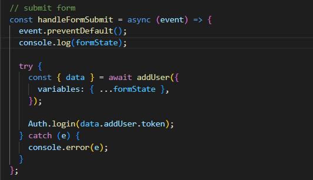
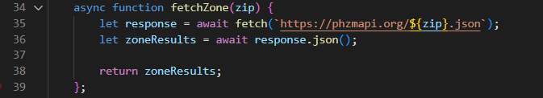
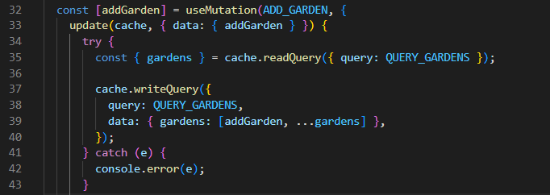
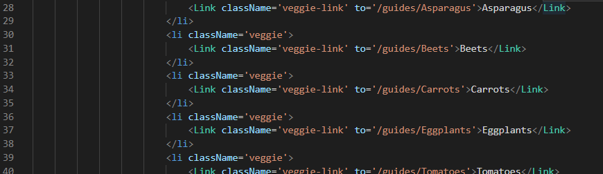

# garden-buddy

## Deployed Webpage

[Garden Buddy](https://gardenbuddies.herokuapp.com/)

## Description

Garden Buddy, the app that grows with you! 

Once logged in, users have access to a multitude of features. Users can discover the zone that they live in, and receive a corresponding planting schedule for that zone. Users can view growing guides to create their own vegetable gardens. Users can add their own gardens, and view previous gardens to keep track of their planting. 

## Features

SIGNUP/LOGIN

Here, the signup mutation is executed, and a token is received. The token is then immediately stored using the AuthService functionality. 

FIND MY ZONE: 

Here is the API call that fetches the specific zone the user lives in based on what zip code is inputted. 

GARDENS: 

Here, the gardens are being queried. 

GUIDES: 

Here, the components for the guides are linked to the main "Grow Guides" page.

## Usage

To access the website, follow the link.

Users must first login or signup. To navigate the website, users can click the links in the navbar, and will be redirected to that specific feature's page. Users can add their own gardens, and view previous gardens to keep track of their planting.Users can discover the zone that they live in, and receive a corresponding planting schedule for that zone. Users can view growing guides to create their own vegetable gardens. Once done, users can logout. 

## Technologies

	

## Installation

1. Create a new repository on Github. 
    - Press the "+" sign on the top right hand corner, or the "new" button on your GitHub homepage. 
    - Create an unique name for your repository, and make the respository public. 
    - Click the "README" option to include the "README" page. 
    - Your new repository has been created.
2. Open GitBash (PC users) or Terminal (Mac users).
    - Navigate to where you want to clone your new repository onto your local machine. 
        - Use `cd` to help you navigate. 
3. To clone the new repository onto your local machine. 
    - Click the respository that you just made on github.com.
    - Click the "code" button and choose the SSH option. 
    - Copy the SSH option to your clipboard. 
    - On GitBash/Terminal, enter the command `git clone git@github.com:<UserNAME>/<demo-repo>.git`
        - After `git clone`, paste the SSH option from your clipboard into GitBash/Terminal.
        - Since the SSH option was used, enter the password for the SSH key when asked. 
4. You have now cloned your new repository.
    - Using `cd`, navigate into your new repository from the location that you have saved it in. 
    - Use `ls` to see what is inside the new repository currently. 
        - It should only include the README page as of now.
5. Tranferring the project files into your new directory on your local machine. 
    - Using Finder/Explorer, copy the corresponding files that are needed to edit your project. 
    - In another Finder/Explorer window, navigate to your new repository, and paste the files directly into that folder. 
6. On GitBash/Terminal, after pasting the project files into the new repository. 
    - Use `ls` to see what is now inside the new repository.
        - This should now include the README page, and the project files that you have copy-pasted in. 
7. Use `git status` to see if there any changes that need to be made to the repository. 
    - At this point, git will tell you that there is an untracked file .
8. Use `git add .` to add the new project files, and allow the new files to be tracked by git.
9. Use `git commit -m "add base project files"` to commit the changes have recently been made to the repository. 
10. Use `git push origin main` to sync your local machine with GitHub. 
    - Enter your SSH password when prompted. 
11. Use `code .` to open the files on a code reader of your choice.
12. Edit the files as necessary in your code reader. 
13. Periodically, and when you are finished with editing your code: 
    - Follow Steps 7-10 to keep your repository up to date with the changes that have been made. 
14. This requires Terminal to start the server. 
    * Run `npm install`.
    * To seed the database: `npm run seed` 
    * To start running the webpage locally: `npm run develop`.
15. You have successfully completed this project!

## Contributors

* Jake Walsh - [GitHub](https://github.com/jkwalsh127) || [LinkedIn](https://www.linkedin.com/in/jake--walsh/)
* Snehita Kolli - [GitHub](https://github.com/snehitak20) || [LinkedIn](https://www.linkedin.com/in/snehita-kolli-0abb23b1/)
* Asika Habib - [GitHub](https://github.com/toma95s) || [LinkedIn](https://www.linkedin.com/in/asikanewaz/)

Give a ⭐️ if you like this project!

## License

Licensed using the [MIT](./assets/license.txt) license.
